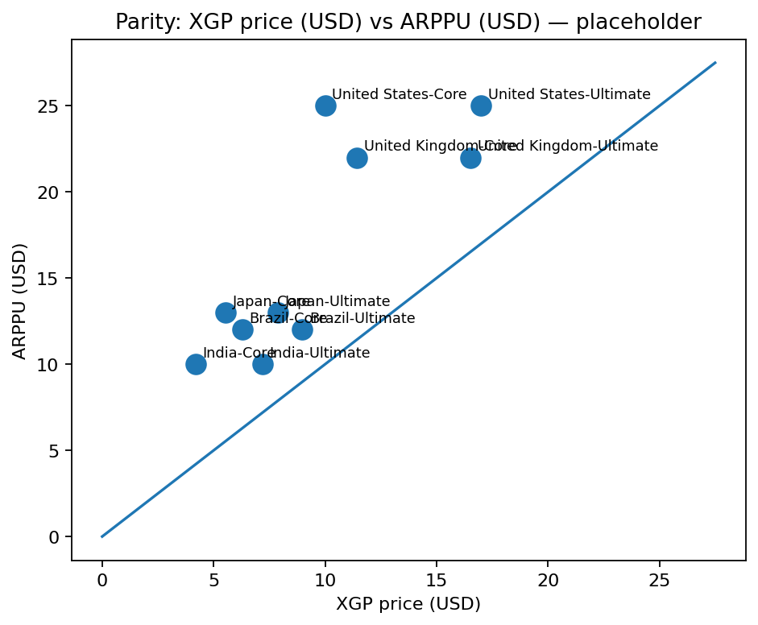

# Xbox Game Pass Pricing vs ARPPU — Study 

**Goal**  
Compare Xbox Game Pass tier prices (USD) against same-market ARPPU/ARPU (USD) to reason about price–to–spend gaps and rough “theoretical vs practical” subscriber ceilings by market/tier.

**Scope & Status**  
Outline with a small **sample dataset (3–5 markets × 2 tiers)** and two placeholder visuals.  
All numbers are **placeholders for demo**; the repo focuses on **methods**, not proprietary figures.

## Data schema (columns)
`country, iso2, year, tier, price_local, currency, fx_usd_per_local, price_usd, arpu_usd, arppu_usd, source`

- `fx_usd_per_local`: USD per 1 unit of local currency  
- `price_usd = price_local * fx_usd_per_local`  
- `arpu_usd / arppu_usd`: market-level proxies in USD from public reports (time-aligned by `year` where possible)

## Methods (outline)
- **FX normalization only**: convert local prices to USD with a consistent FX source.  
- Compute **gap & ratio** within each market/tier:  
  - `gap_arppu = price_usd - arppu_usd` (USD difference)  
  - `ratio_arppu = price_usd / arppu_usd` (parity line at 1.0)  
  - (Optionally) the same vs **ARPU**.  
- Flag outliers with a simple IQR/MAD rule (toy in this outline).
- Visuals:  
  1) **Parity scatter**: `price_usd` (x) vs `arppu_usd` (y) with a y=x line.  
  2) **League table** by `ratio_arppu` (ascending) or `gap_arppu`.

## “Ceilings” (toy, for illustration only)
- **Theoretical ceiling (toy)** ~ `arppu_usd / price_usd`.  
- **Practical ceiling (toy)** ~ `theoretical * adoption_factor` with a cap (e.g., 0.2–0.5, bounded).  
  These are not forecasts—just a consistent way to rank affordability headroom across markets.

## Caveats
- ARPU/ARPPU proxies are imperfect and may be time-misaligned by year; note sources and vintage.  
- Tier names/benefits change over time; treat `tier` as a moving label.  
- This repo keeps **methods & placeholders**, not paid data.

## Next
- Expand to ~40 regions and multiple tiers.  
- Tighten ARPU/ARPPU vintage matching and sensitivity tests.  
- Add scenario notes (recession, tier changes).

